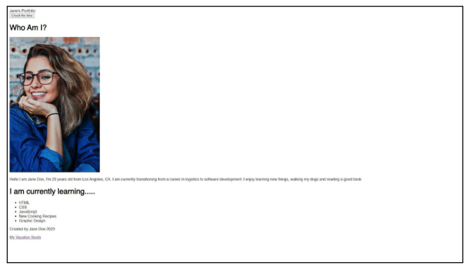
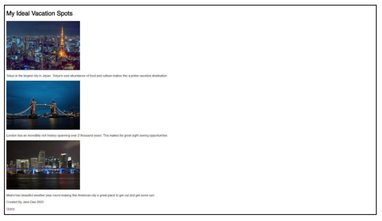
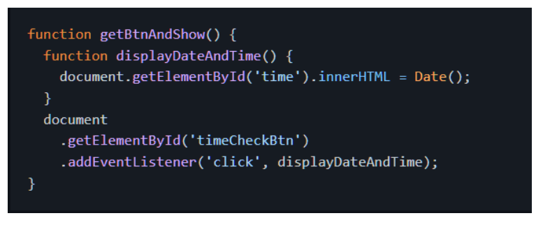
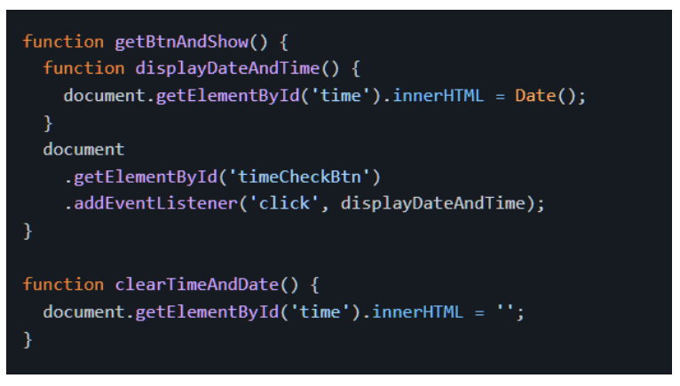
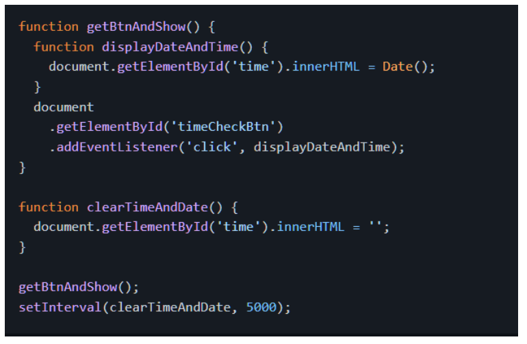

# GitHub Classroom Portfolio Project Introduction

The aim of this project is to create a fundamental portfolio site that you can revisit, enhance, deploy, and showcase upon finishing the Savvy Coders Fullstack Cohort. To construct this site, you will utilize the knowledge and skills in HTML, CSS, and JavaScript that you've acquired throughout this course.

## Getting Started

Access the GitHub Classroom repository provided for this project. This repository includes the following files:

- index.html
- page2.html
- styles.css
- script.js

These files are accessible within the repository's file structure.

Before you begin coding, follow these steps:

1. **Clone the Repository:** Clone the GitHub Classroom repository to your local machine using the URL provided.
2. **Open with VS Code:** Open the cloned repository using Visual Studio Code (VS Code).
3. **Edit and Preview:** Modify the files using VS Code and use the integrated Live Server extension to preview your changes in real time.
4. **Commit and Push:** After making changes, commit your code and push it back to the repository on GitHub.

## Ready to Code

Now you're all set to begin coding and building your portfolio using VS Code and GitHub Classroom.

## Laying the foundation: HTML

Let's start by adding some basic HTML elements to our index.html file.

In the index.html file do the following:

- Change the \<title> so that is says My Portfolio
- \<link> your CSS file to your HTML file in the appropriate location
- add a \<header> that says [Your Full Name]'s Portfolio
- beneath the \<header> add a \<button> that says Check the Time and has an id attribute of timeCheckBtn
- beneath the \<button> add a \
 with an id attribute of time
- beneath the time \
 create another \
 with an id attribute of about-me and a class attribute of content
- Inside the about-me \
 that you just created, add an \<h1> that says Who am I?
- beneath the \<h1> add an \ that has an id attribute of my-pic that is a picture of you
- beneath the \ add a \
that has a short description that talks about where you are from, what you like to do as hobbies and why you want to get into software development
- beneath the about-me \
 create a new\
 with an id attribute of now-learning and a class attribute of content
- inside the now-learning \
 that you just created, add an \<h1> that says I Am Currently Learning...
- beneath the \<h1> from the previous step, add a \<ul> and inside of it add up to 6 \<li>'s that list some things you are currently learning or that you are interested in learning:

        For Example:

        HTML

        CSS

        JavaScript

        Web Development

- beneath the now-learning \
 create a \<footer>
- inside the \<footer> add a \
 that says Created by [Your Full Name] 2023
- beneath the \
 add an \<a> that has an href attribute of page2.html and says My Vacation Spots so that we can navigate to the second page of our website

After completing the steps above your index.html web page should look something like this:

Now let's work on our second page. In the page2.html file do the following:

- Change the \<title> so that it says My Ideal Vacation
- \<link> your CSS file to this HTML file just like you did in the index.html file
- create a \
 with an id attribute of vacation-content
- inside the vacation-content \
 add an \<h1> that says My Ideal Vacation Spots
- beneath the \<h1> add up to 3 \ tags that each have src attributes of pictures of places you would like to visit, or you have visited that you really enjoyed
- beneath the \ add a \
 that has a short description of the place you chose and why you would like to visit or why you enjoyed visiting
- beneath the vacation-content \
 create a \<footer>
- inside the \<footer> add a \
 that says Created by [Your Full Name] 2023
- beneath the \
 add an \<a> that has an href attribute of index.html and says Home so that we can navigate back to the first page of our website

After completing the steps above your page2.html web page should look something like this:

\

\

## HTML Bonus (Optional)

After you have completed the steps above, feel free to try to add some more HTML elements to your website. This part is optional and not required.

Here are some ideas:

- on your index.html page, add a \
 with an id of contact-me and a class of content
- give your \ tags an alt attribute with a short description of the image
- give your \<a> tags a target attribute with a value of _blank
- add \<a> tags to the images on your page2.html page that link to the Wikipedia pages for each place you chose
- add a more detailed description of each place you chose on your page2.html page
- add a \<ul> with up to 3 \<li> to each vacation spot on your page2.html page that lists the top 3 things you would like to do at each place

## Adding Some Style: CSS

Now that we have our HTML elements in place, let's add some style to our website.

In the styles.css file do the following:

- apply a background-color to the \<body> of your website
- add a margin of 0 to the \<body> of your website
- change the color of the text in all \
s to something different than the default
- change the font-family of all \
 and h1 tags to Arial, Helvetica, sans-serif
- align the text in the \<header> and \<footer> to the center
- change the background-color of the \<footer> to something different than the default
- add a border-radius of 25px to all \ tags
- align all the contents of the body to the center
- change the font-weight of all the text in the footer
- add some text-decoration to all the \<h1> tags
- make the list-style-type of the \<ul> be none
- change the font-size of \<li> so that it's easier to read

## CSS Bonus (Optional)

After you have completed the steps above, feel free to try to add some more style to your website. This part is optional and not required.

Here are some ideas:

- move elements around on the page using position and top, bottom, left, and right
- make your profile picture a circle using border-radius
- implement a hover effect on your \<a> tags
- add a background-image to your \<body> tag
- make your \<footer> fixed to the bottom of the page
- find a different font-family that you like and use it for your \<h1> and \
 tags
- give your \<header> a different background-color than the rest of the page
- add a border to your \<footer>
- add a box-shadow to your my-pic \
- if you feel as though your images are too small/big, try to make them smaller using width and height

If you are feeling adventurous, try to make your website responsive using @media queries!

## Adding Some Functionality: JavaScript

Now that we have our HTML elements in place and we have added some style to our website, let's add some functionality next.

Firstly, let's break our script.js file into three parts.

1. The first part will be used to display the current date and time on our index.html page.
2. The second part will be used to create a function that clears the date and time that we just displayed our index.html page.
3. The third part will be used to call/invoke the function that displays the date and time then call the function that clears the date and time after a set period.

## JavaScript Part 1: Displaying the Date and Time

- create a function called getBtnAndShow
- inside the getBtnAndShow function create another function this time called displayDateAndTime
- inside the displayDateAndTime function, use document.getElementById() to get the time \
 that is in our index.html file
- attach .innerHTML to the end time \
 and set it equal to Date()
- beneath the displayDateAndTime function, use document.getElementById() to get the timeCheckBtn \<button> that is in our index.html file
- add an eventListener to the timeCheckBtn \<button> that listens for a click event and calls the displayDateAndTime function

If you followed the steps correctly your script.js file should look something like this (bear in mind it will NOT likely be EXACTLY this - some details may be altered in these code examples so that you are not being handed the answer! Make sure to compare the code sample against the requirements/instructions - do not just copy what you see here without thinking it through!):

And the button that you created will display the current date and time when you click it!

## JavaScript Part 2: Clearing the Date and Time

- create a function called clearDateAndTime
- inside the clearDateAndTime function, use document.getElementById() to get the time \
 that is in our index.html file
- add .innerHTML to the end of the time \
 and set it equal to an empty string ''

If you followed the steps above correctly your script.js file should look something like this now (don't forget our caveat about this from Part 1!):

## JavaScript Part 3: Calling Our Functions

- call the getBtnAndShow function
- call the pre-built setInterval() function, pass in the clearTimeAndDate function and a time interval of 5000

Finally, your script.js file should look something like this (remember our caveat!):

And once you click the button, the date and time will be displayed for 5 seconds then it will disappear!

## JavaScript Bonus (Optional)

After you have completed the steps above, feel free to try to add some more functionality to your website. This part is optional and not required.

Here are some ideas:

- create a function that changes the background-color of the \<body> tag when you click a button
- create a function that changes the font-size of the \<h1> tags when you click a button
- add a mouseover event to your \ tag that changes the border-radius of the \ tag
- use the onload event to display an alert when the page loads

## Submitting Your Work

Once you've completed all the sections of your portfolio project, follow these steps:

1) Commit and Push: Ensure all your changes are committed and pushed to the GitHub repository.
2) Copy Repository URL: Copy the URL of your GitHub repository.
3) Share URL: If required, share the URL of your repository with the appropriate individuals for review and assessment.

WAY TO GO! 🚀
You've literally just built a website.
What's next??? 🤔
